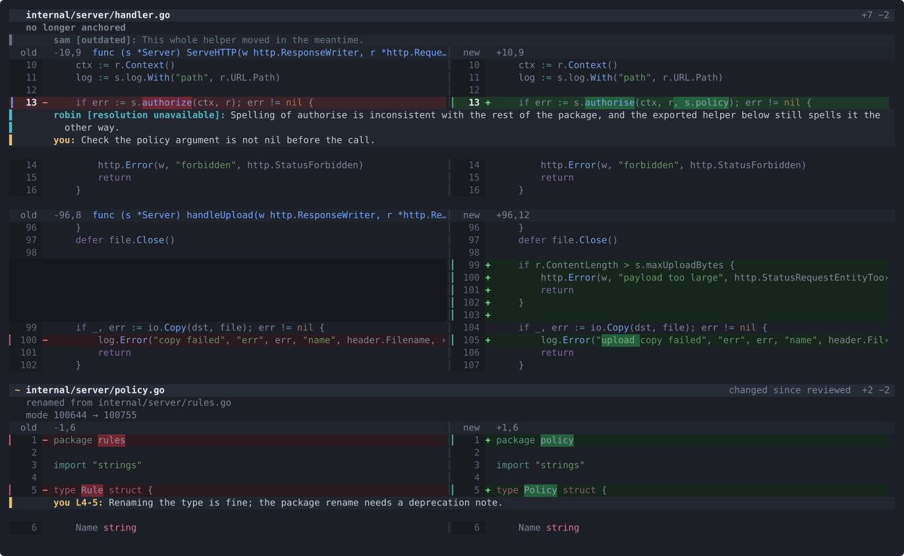
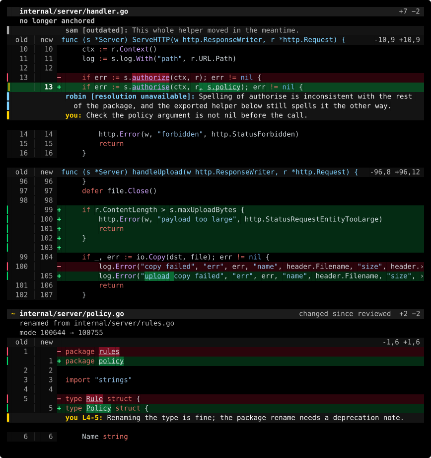

# crv

Review code without leaving the terminal.

`crv` renders and navigates diffs, drafts review comments on lines, shows what
your teammates already said, and submits the whole thing to GitHub as one
review — without leaving the terminal.


## Install

```sh
go install github.com/tobiasbernting/code-review-cli/cmd/crv@latest   # or @main
```

`@latest` is the newest tagged release; `@main` is the current main branch.
Re-run the same command to update. `crv --version` reports which one you have,
even for a `go install` build.

Or download a binary for macOS, Linux or Windows from the
[releases](https://github.com/tobiasbernting/code-review-cli/releases) page and
put it on your `PATH`. From a clone: `go build -o crv ./cmd/crv`.

## Use

```sh
crv                    # the pull requests waiting on your review
crv .                  # uncommitted work, including untracked files
crv main...feature     # a revision range
crv HEAD~3..HEAD
crv 42                 # pull request 42, via gh
crv . | less -R        # non-interactive: prints and exits
```

Local reviews need only git. The queue and pull requests need
[gh](https://cli.github.com), which already knows your host and credentials —
including an enterprise one.

### The queue

A bare `crv` lists what is waiting on you, across every repository, with CI
status, age, and how many unsent drafts you already have on each. `enter` (or a double click)
opens one, `t` switches to your own pull requests, `r` refreshes.

The list is one GraphQL request and is cached for five minutes; a failed
refresh shows the cached list rather than an empty screen. Diffs are never
cached — reviewing a stale diff is the worst thing this tool could do.

Untracked files are shown as additions on purpose: when reviewing generated
code, the new files are usually the point of the change, and plain `git diff`
hides them.

### Keys

| key | action |
| --- | --- |
| `j` / `k`, arrows | move |
| `ctrl+d` / `ctrl+u` | half page |
| `tab` / `shift+tab` | next / previous file |
| `n` / `p` | next / previous hunk |
| `J` / `K`, `]` / `[` | next / previous file (aliases) |
| `g` / `G` | top / bottom |
| `h` / `l` | scroll horizontally, `0` to reset |
| `f` | file list |
| `s` | toggle split / unified layout for this session |
| `r` | sync the current pull request |
| `N` / `P` | next / previous thread with new activity |
| `enter` | expand a thread or open a comment |
| `?` | every key, grouped, with a few recipes |
| `q` | quit |

Reviewing:

| key | action |
| --- | --- |
| `c` | draft a comment on this line or the selection |
| `v` | start or clear a selection, then move and press `c` or `y` |
| `e` / `d` | edit / delete the draft under the cursor |
| `m` | move a detached draft to a new line or range |
| `ctrl+e` | finish a draft in `$EDITOR` instead |
| `x` | mark this file reviewed |
| `S` | submit the review to GitHub |
| `y` | copy the selection, or the line, hunk or path under the cursor, as code |
| `Y` | copy a reference to it instead, as `path:L12-L18` |

### Mouse and clipboard

The wheel scrolls; the cursor stays put unless it would leave the screen.
`shift`+wheel scrolls sideways. A click moves the cursor, a double click does
what `enter` does, and a drag selects lines for a comment or a copy — within
one hunk, scrolling when it reaches the edge. The file list, the thread list
and the queue select on click and open on double click.

While crv has the mouse, the terminal's own text selection needs a modifier:
hold `shift` in most terminals, `option` in iTerm2, `fn` in Terminal.app. That
selection copies the gutter and, in split layout, both sides; `y` copies just
the code. Set `mouse = false` to give the mouse back to the terminal.

`y` and `Y` write to the clipboard through the terminal (OSC 52), which works
over SSH and inside tmux (with `set -g allow-passthrough on`), and, when
running locally, through `pbcopy`, `wl-copy`, `xclip`, `xsel` or `clip.exe` as
well, for terminals that ignore OSC 52.

### Flags

| flag | effect |
| --- | --- |
| `--theme <name>` | colour theme: `dark`, `light`, `high-contrast` (default `dark`) |
| `--syntax <name>` | chroma style for code, overriding the theme's own |
| `--density <name>` | `comfortable` or `compact` row density |
| `--layout <name>` | `unified` or `split` diff layout (default `unified`) |
| `--no-color` | disable colour; `NO_COLOR` is honoured too |
| `--no-untracked` | exclude untracked files |
| `--width <n>` | output width when stdout is not a terminal |
| `--host <name>` | GitHub hostname; defaults to gh's own configuration |
| `--export markdown` | print this review's drafts and exit |
| `--limit <n>` | how many pull requests the queue lists (default 30) |
| `--config` | print the resolved configuration and exit |
| `--init-config` | write a starter configuration file and exit |
| `--version` | print version and exit |

## Reading the diff

Every row sits on the same grid, so the eye can lock onto one column and scan
down it:

```
▎  12 │  14 + func Greet(name string) string {
│   │     │  │ │
│   │     │  │ └─ code, syntax muted so diff state wins
│   │     │  └─── sign: + added, − deleted, blank unchanged
│   │     └────── new-side line number
│   └──────────── the rule separating old from new
└──────────────── edge: diff marker, or the focus bar on the cursor row
```

Add and delete are stated three times over — edge marker, sign, row tint — so
the diff still reads with colour disabled or unperceived, and so that focusing
a row can lift its tone without erasing what kind of line it is. A `›` at the
right edge means the line continues past it; `h` and `l` (or `shift`+wheel)
scroll to see it. Drafts and review comments wrap to the terminal instead, hanging under their
author's name: one line where they sit, expanded while the cursor is on them,
so a conversation never buries the code it is about.

Themes are chosen, not detected: `dark`, `light` and `high-contrast` each set a
background, so crv never has to guess what your terminal is and never guesses
wrong. Syntax colour is muted toward the surface — least of all on function,
method and type names — so diff state wins the page while code keeps its shape.
`--syntax` overrides the chroma style a theme comes with, and a `theme` naming
a chroma style still means what it used to.

Set the one you want once, in `~/.config/crv/config.toml`:

```toml
theme = "light"       # dark, light or high-contrast
```

That is the whole file — every other setting keeps its default. Three lines go
further:

```toml
theme = "dark"
syntax = "monokai"    # keep the theme, change the code colours
density = "compact"   # no separation between hunks
```

Split puts old and new side by side instead of interleaving them. It needs
room: below 140 columns crv draws unified until the terminal is wide enough,
and piped output (120 columns unless `width` says otherwise) does the same.
`s` flips between the two for the current session; to make split the default:

```toml
layout = "split"      # unified or split
```



Try one before committing to it, without touching the file:

```sh
CRV_THEME=high-contrast crv .     # this review only
crv --theme light .               # or just this run
```

<details>
<summary>The same diff in <code>light</code> and <code>high-contrast</code></summary>




</details>

[docs/rendering.md](docs/rendering.md) explains the row anatomy, the theme
roles, syntax muting and the golden tests — read it before changing how any of
this looks.

## Drafts and reviews

Drafts are stored outside the repository — under `~/.config/crv`, or
`$XDG_CONFIG_HOME/crv` if that is set — so they never pollute a worktree that
is shared or reset. They are keyed by pull
request number, or by branch for local work, so an agent rewriting files
underneath you does not orphan them.

Each draft records the blob hash of the file it was written against. When the
file changes, the draft is shown as **needs re-anchor** and detached from its
line rather than pointing at a line that has since moved. Press `m`, navigate
to its new line, and press `enter`; press `v` first to make a selection. A draft
that needs re-anchoring cannot be submitted. The same change detection applies
to a file marked reviewed: it keeps its tick and gains a `~`, because silently
unticking would hide that you had already read it.

Nothing is sent anywhere until you press `S`. GitHub reviews are atomic, so
every draft is posted as a single review with one event — comment, approve, or
request changes — rather than as a stream of separate comments. Once submitted,
the local copies are dropped: GitHub owns them from then on, which is what stops
two versions of the same review from disagreeing.

For a local review with no pull request to post to, `crv --export markdown`
prints the drafts for pasting wherever they need to go.

### Comments and sync

GitHub review discussions are shown as threads. `outdated` means GitHub can no
longer anchor a thread to the current diff; `resolved` means the discussion was
closed. These states are independent, and neither blocks your review. Long
comments expand to eight lines under the cursor; `enter` opens the complete
scrollable body.

Press `r` to fetch the latest diff and review threads as one update. Local
drafts are preserved, the cursor stays near the same file and line, and new or
edited comments are marked until visited. A failed sync leaves the existing
view intact. See [Comments and sync](docs/comments-and-sync.md) for the complete
state and failure model.

## Configuration

Optional — crv works with none. To start from a documented file:

```sh
crv --init-config          # writes ~/.config/crv/config.toml
```

Every setting in it is commented out, so nothing is overridden until you
uncomment it. That is deliberate: a starter file listing real values would pin
today's defaults forever, and a later change to one would never reach you.
[`config.example.toml`](config.example.toml) is the same file, for reading here.

Settings are resolved from, highest priority first: command-line flags, `CRV_*`
environment variables, `.crv.toml` in the repository, and
`~/.config/crv/config.toml`. `crv --config` prints what won and whether each
file exists.

On Windows the directory is `%AppData%\crv`, where that convention applies
instead.

```toml
# .crv.toml — checked in, or not, as you prefer
host = "github.example.com"   # default: whatever gh is configured with
theme = "dark"                # dark, light or high-contrast
syntax = "catppuccin-mocha"   # any chroma style name
density = "comfortable"       # comfortable or compact
layout = "unified"            # unified or split; split needs 140 columns
editor = "hx"
untracked = true
color = true
mouse = true                  # false leaves clicks and drags to the terminal
width = 120
```

`host` is empty by default on purpose: gh already knows whether you are on
github.com or an enterprise host, and a repository-local file is a better place
to override that than global state you forget you set.

Themes are the setting most worth putting in the user file rather than a
repository one: which theme reads well is a fact about your terminal, not about
the code being reviewed.

## Layout

| package | role |
| --- | --- |
| `internal/diffparse` | unified diff → structs; hunk bodies parsed lazily |
| `internal/gitsrc` | shells out to `git` for diffs and stats |
| `internal/render` | diffs → styled rows; syntax and word-level highlighting |
| `internal/tui` | bubbletea viewport over those rows |
| `internal/notes` | review notes and per-file marks on disk |
| `internal/clipboard` | OSC 52 and the platform copy command |
| `internal/ghsrc` | pull requests, comments and review submission, via `gh` |
| `internal/config` | settings resolution |

`render` has no dependency on the TUI, which is what lets the same rows serve
the interactive view, the piped output, and the golden-file tests.
[docs/rendering.md](docs/rendering.md) is the guide to that package: row
anatomy, theme roles, density, annotation wrapping, and how the screenshots
above are generated.

## Tests

Run them before pushing — CI only checks that the project builds on all three
platforms, it does not run the suite.

```sh
go test ./...
go test ./internal/render -update   # rewrite golden files

# regenerate the theme screenshots the README embeds
go test ./internal/render -run TestWritePreviewSVG -preview docs/img
```

## Releasing

Merging to `main` is the whole process. release-please gathers merged pull
requests into a release pull request with a generated changelog. Merging that
pull request makes the workflow tag the version, and the tag makes GoReleaser
publish the release with binaries for macOS, Linux and Windows.

The tag is the handover point on purpose: immutable releases are enabled on
this repository, so a release cannot gain assets after it is published.
Whoever creates it must create it complete, which has to be GoReleaser.

If release-please's bookkeeping ever gets stuck, pushing a `v*` tag by hand
builds and publishes that tag directly.

Pull request titles must be conventional commits (`feat:`, `fix:`, `feat!:`)
— the squash-merge title becomes the commit message release-please reads, and
`pr-title.yml` rejects anything else before merge.

One secret is required: `RELEASE_PLEASE_TOKEN`, a fine-grained personal access
token for this repository with **Contents: read and write** and **Pull
requests: read and write**. GitHub deliberately does not trigger workflows for
anything pushed with the built-in `GITHUB_TOKEN`, so a release pull request it
opened would carry no check runs and could never satisfy the branch ruleset.

To check a change to the release setup without tagging:

```sh
goreleaser check
goreleaser build --snapshot --clean
```

## Planned

- Replying to a teammate's comment thread
- `LEFT`-side comments on deleted lines

### Follow-up reviews

Reopening a teammate's PR starts from your own threads when you have a submitted
review, including one made in GitHub's browser UI. Resolved threads stay visible.
Use `enter` for original context, related changes, replies, and current context;
`x` verifies locally, `c` replies, and `R` resolves or reopens on GitHub.

Use `a` for all changes since your latest review and `D` for the current PR diff
and draft re-anchoring. `S` supports clean approvals and pins submission to the
reviewed commit. `r` refreshes the snapshot and review baseline together.
See [comments and sync](docs/comments-and-sync.md) for verification and failure
semantics. Copilot highlighting and automated fix analysis remain TODOs.
